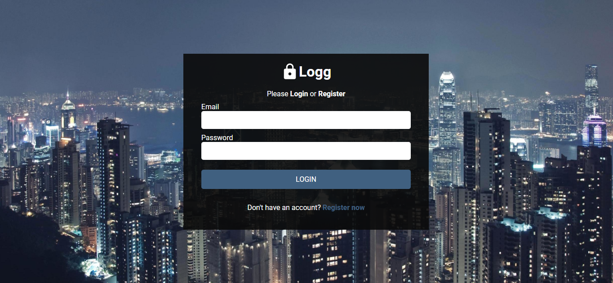

<h1 align="center">Logg</h1>




<p align="center" >  
    <a href="#description">Description</a> • 
    <a href="#status">Status</a> • 
    <a href="#how to run the app">How to run the App</a> • 
    <a href="#technologies">Technologies</a> • 
    <a href="#version">Version</a>
</p>


## Description
**Login app**
Pages/Routes:
- Login
- Register
- Home
After registration and once logged in, the user will be redirected to home page and will get access to private routes.
The register page will have validations and the login will be authenticated.


## Status

 🚧⛔  Under construction - Not finished  ⛔🚧 


## How to run the app
- Open cmd and clone the repository:
``` $ git clone https://github.com/FabianaMendes/login-aut ```
- Access project folder in terminal/cmd: 
``` $ cd login-aut ```
- Install the dependencies:
``` $ npm install ```
- To open the project in the code editor: 
``` $ code . ``` 
- To run the application locally in your browser:
``` $ npm start ```
_The server will automatically start at port:3000 - access [http://localhost:3000](http://localhost:3000)
To stop the application press Ctrl + c_


## Technologies
The following tools were used in the construction of this project:

**Web-app ([React](https://pt-br.reactjs.org/)) & ([Typescript]())**
- [React Router](https://reactrouter.com/web/guides/quick-start)
- [Axios](https://www.npmjs.com/package/axios)
- [Styled Components]()
- [History]()

**Utilities**
- Editor: [Visual Studio Code](https://code.visualstudio.com/)
- Package Manager: [Npm]()
- Fonts: [Roboto]()


## Version
<p>Version 1.0</p> 
